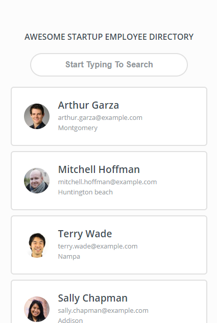

# Employee Directory Project

This was the project #8 of the [Treehouse Front End Web Development Techdegree](https://teamtreehouse.com/techdegree/front-end-web-development-2).  
The purpose of this project is to help myself practicing the concept of utilizing the `fetch` API to pull data from an online API asynchronously. It also helped me understand `Promise`. 
What this project really showed/taught me is that how easily front end code can get messy and hard to maintain when it comes to data handling without a legit framework. I already see myself creating several global variables that could end up being hazardous in the future if the project scale grows. 
After finishing this project, I re-wrote it completely with _React_. Please check it out [Here](https://github.com/patrickmao93/EmployeeDirectory-React-Refactor) 

## Instruction From Treehouse

> Awesome Startup is a distributed company with employees working all over the world. They need a smart way to for employees to share contact information with each other. In this project, you’ll use the Random User Generator API (https://randomuser.me/) to grab information for 12 random “employees,” and use that data to build a prototype for an Awesome Startup employee directory. You’ll request a JSON object from the API using fetch and parse the data so that 12 employees are listed in a grid with their thumbnail image, full name, email, and location. Clicking the employee’s image or name will open a modal window with more detailed information, such as the employee’s birthday and address.

## Starter Content From Treehouse

- Mockup image for large screen size (width > 1024px)

## Deliverable

- A fully responsive front-end of a fictional employee directory.

## Screenshots

Small Screen Size

    

Medium Screen Size

    

Large Screen Size

    

Modal UI

    

